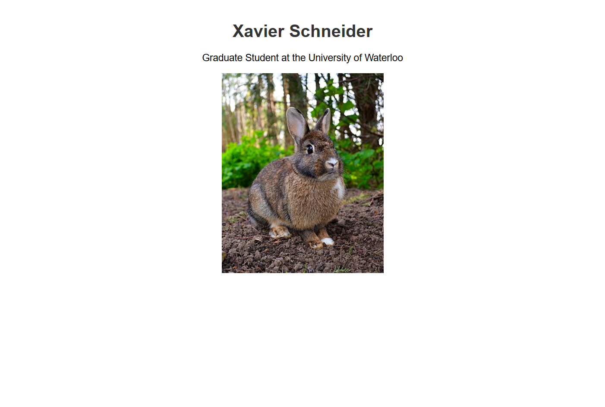
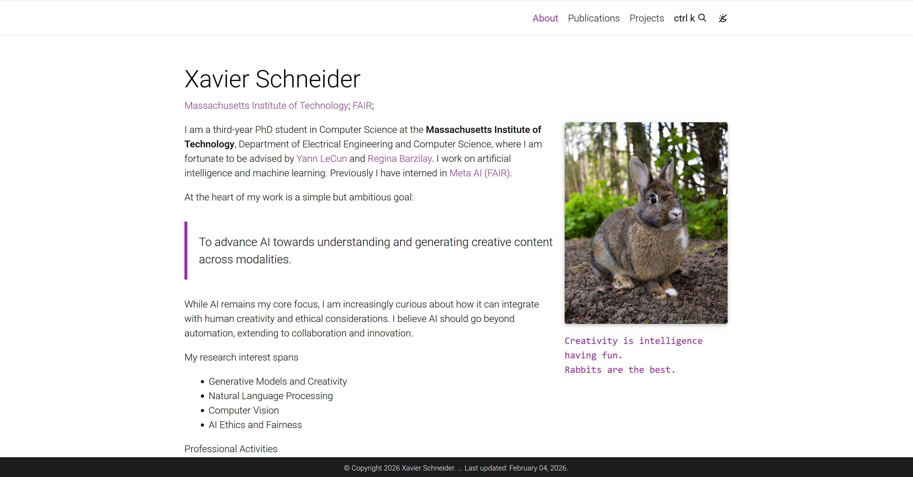

# Week 6 Evaluation: CodeGen / Planning

**Authors:** Xavier Schneider, Greg French, Max Ku 


## 1. Evaluation Criteria

* The code should pass the automated tests (correctness)
* The code should be readable
* The code should be well-architected (modular, extensible, etc.)

---

## 2. Evalation specifically for Example Problems

### Problem A: Exam Score Analysis

**Evaluation Description:**  

* The code should use the provided python library
* The code should be short (no more than 30 lines)
* The code should pass the automated tests (correctness)

**Bad example**

Context (full git repo): https://github.com/Xavier-Schneider/CS846-CodeGen-Exercises

Prompt: Solve problem A 

```
def problem_A(records):
    # Validate input
    if records is None:
        raise ValueError("Records cannot be None")
    records = list(records)  # Convert to list to allow multiple iterations
    if not records:
        raise ValueError("Records cannot be empty")
    
    # Validate each record
    required_keys = {"name", "score", "weight"}
    total_weight = 0.0
    weighted_sum = 0.0
    max_score = -1
    top_student = ""
    pass_count = 0
    grade_counts = {"A": 0, "B": 0, "C": 0, "F": 0}
    
    for record in records:
        if not isinstance(record, dict):
            raise ValueError(f"Each record must be a dictionary, got {type(record)}")
        if not required_keys.issubset(record.keys()):
            missing = required_keys - record.keys()
            raise ValueError(f"Record missing required keys: {missing}")
        
        name = record["name"]
        score = record["score"]
        weight = record["weight"]
        
        # Validate name
        if not isinstance(name, str) or not name.strip():
            raise ValueError(f"Name must be a non-empty string, got {name}")
        
        # Validate score
        if not isinstance(score, (int, float)) or score != score:  # Check for NaN
            raise ValueError(f"Score must be a valid number, got {score}")
        if not (0 <= score <= 100):
            raise ValueError(f"Score must be between 0 and 100, got {score}")
        
        # Validate weight
        if not isinstance(weight, (int, float)) or weight != weight:  # Check for NaN
            raise ValueError(f"Weight must be a valid number, got {weight}")
        if weight <= 0:
            raise ValueError(f"Weight must be positive, got {weight}")
        
        # Accumulate for weighted average
        weighted_sum += score * weight
        total_weight += weight
        
        # Check for top student
        if score > max_score:
            max_score = score
            top_student = name
        
        # Count passes
        if score >= 50:
            pass_count += 1
        
        # Grade distribution
        if score >= 70:
            grade_counts["A"] += 1
        elif score >= 60:
            grade_counts["B"] += 1
        elif score >= 50:
            grade_counts["C"] += 1
        else:
            grade_counts["F"] += 1
    
    # Compute statistics
    weighted_average = round(weighted_sum / total_weight, 2)
    pass_rate = round((pass_count / len(records)) * 100, 2)
    
    return {
        "count": len(records),
        "weighted_average": weighted_average,
        "top_student": top_student,
        "pass_rate": pass_rate,
        "grade_distribution": grade_counts
    }
```

**Good example**

Context (full git repo): https://github.com/Xavier-Schneider/CS846-CodeGen-Exercises

Prompt: Solve problem A by making use of the examlib library under misc -> src -> library.py

```
from problems.misc.src import library as examlib

def problem_A(records):
    # Validate records using examlib
    validated_records = examlib.validate_records(records)
    
    # Compute statistics using examlib functions
    count = len(validated_records)
    weighted_avg = examlib.weighted_average(records)
    top_student_name = examlib.top_student(records)
    pass_rate_pct = examlib.pass_rate(records)
    grade_dist = examlib.grade_distribution(records)
    
    # Return the summary dictionary
    return {
        "count": count,
        "weighted_average": weighted_avg,
        "top_student": top_student_name,
        "pass_rate": pass_rate_pct,
        "grade_distribution": grade_dist
    }
```

**Analysis**
The good example makes use of guideline 1, i.e. it used the provided library. The bad example does not use the library, as a result it produced a giant block of duplicate code.
---

### Problem A_2: [Title]

**Evaluation Description:**  
Describe the evaluation criteria clearly and precisely.

**Code:**  
// Include all necessary code here that is the correct answer.

---

### Problem A_n: [Title]

**Evaluation Description:**  
Describe the evaluation criteria clearly and precisely.

**Code:**  
// Include all necessary code here that is the correct answer.

### Problem D: Building a personal website

**Evaluation Description:**

* The website is compelling (looks good)
* The website is functional (it has the elements of a graduate student website - publications, socials, etc.)

**Bad Example**
Context: (No context given - empty folder)

Prompt: build a website for a graduate student named xavier schneider who goes to the university of waterloo. The website needs to be hosted on a server. Include an image of a rabbit on the website.

Copilot: ... (output too large to include, see end result)

result:



**Good Example**
Context: (No context given - empty folder)

Prompt: Create a simple python app that serves a static webpage using flask. Manage your dependencies in a virtual environment.

Copilot: ... (output too large to include, see end result)

Prompt: Use the html/javascript from this website as a base for my own. https://kuwingfung.github.io/

Copilot: ... (output too large to include, see end result)

Prompt: Change it so that it's about Xavier Schneider, and a bunch of made up publications.

Copilot: ... (output too large to include, see end result)

Prompt: Use a picture of a rabbit instead of the human.

result:



**Analysis**
The good example makes use of guidelines 1, 5 and 6. As a result, the final website is much more compelling visually and in terms of content. (note: in this particular example, we use other websites as examples - examples like this must be used with permission, or else simply draw inspiration from these websites.)

---

## 3. References

[1]  
[2] 

---
